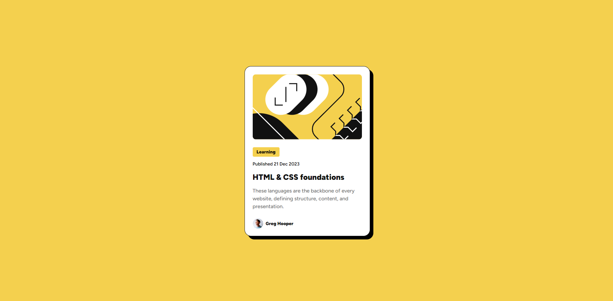

# Frontend Mentor - Blog preview card solution

This is a solution to the [QR code component challenge on Frontend Mentor](https://www.frontendmentor.io/challenges/blog-preview-card-ckPaj01IcS). Frontend Mentor challenges help you improve your coding skills by building realistic projects.

## Table of contents

- [Overview](#overview)
  - [Screenshot](#screenshot)
  - [Links](#links)
- [Author](#author)
- [Acknowledgments](#acknowledgments)

**Note: Delete this note and update the table of contents based on what sections you keep.**

## Overview

### Screenshot

### Links

- Solution URL:(https://github.com/SantiagoMartinez99/frontend-mentor-2)

## Author

- Website - [Santiago Martinez Portfolio](davidmartinezdevv.netlify.app)
- Frontend Mentor - [@SantiagoMartinez99](https://www.frontendmentor.io/profile/SantiagoMartinez99)
- GitHub - [SantiagoMartinez99](https://github.com/SantiagoMartinez99)
